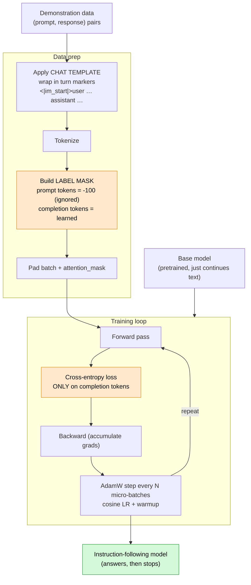
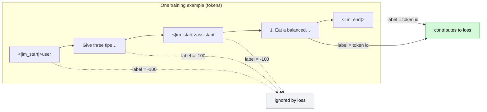
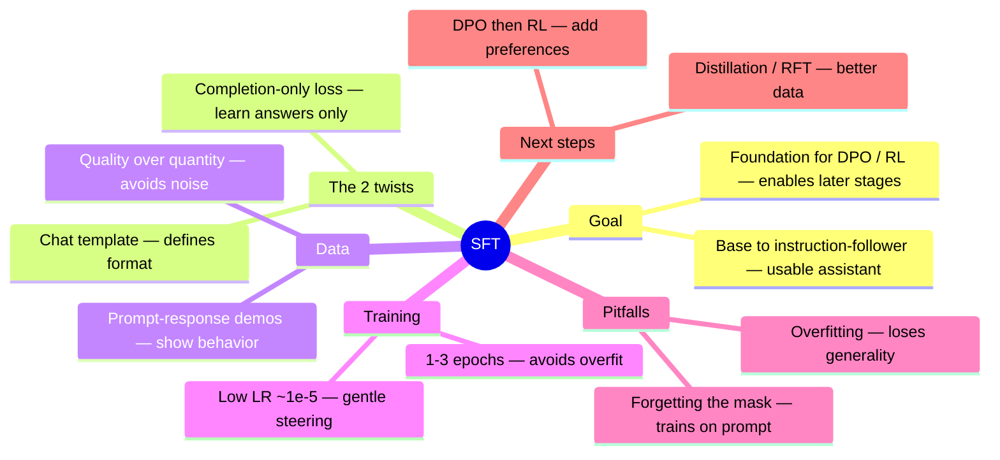
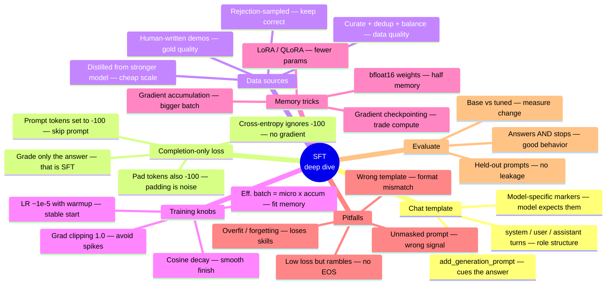
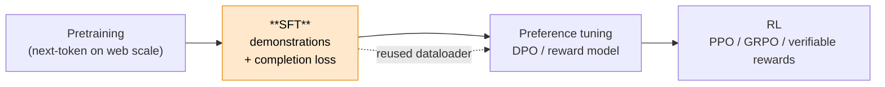

# SFT — Key Concepts, Visualized

Supervised Fine-Tuning (SFT) in one page. These diagrams render natively on GitHub.

---

## 1. The SFT pipeline (data → loss → tuned model)

**The one idea:** the label mask (`-100` on the prompt) is what makes this *SFT* and not
just more pretraining — the model is graded **only** on producing the response.

---

## 2. What the label mask actually does (token level)

---

## 3. SFT mindmap

### 3b. Drill-down mindmap (the details)

Use the overview above to orient; use this when you want the specifics under each branch.

---

## 4. Where SFT sits in the post-training stack

SFT is step 1 and the reusable base: preference tuning and RL both start from an SFT'd model.
